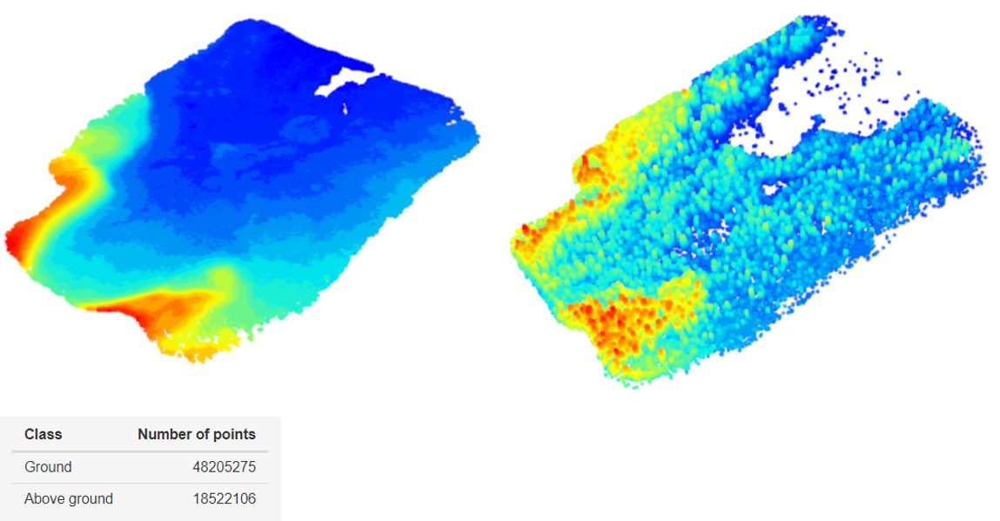
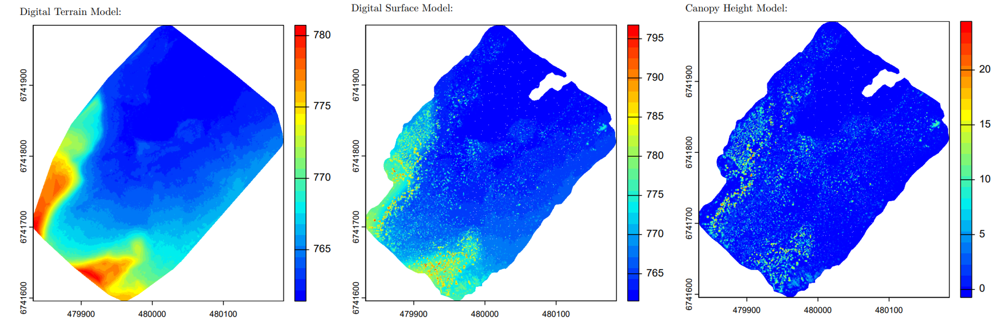
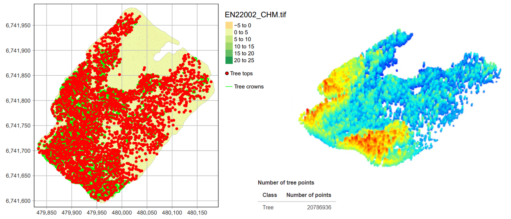
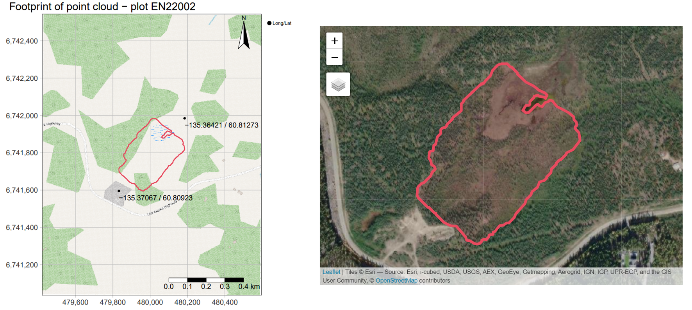
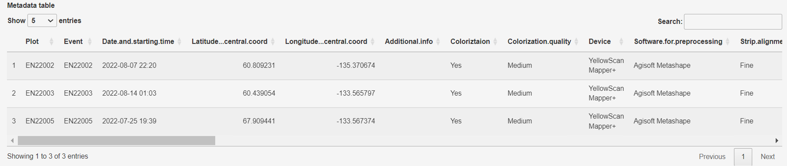

### PC2RCHIVE application
<br />
<br />
The main purpose of the application is to process point clouds of vegetation plots collected during the Alfred-Wegener-Institute's data collection campaigns.<br />
The two main steps of data processing are ground classification and tree identification. As part of the processing, digital elevation models of the point clouds and maps of the point cloud positions are generated.
The user also provides metadata related to data acquisition and point cloud generation. This metadata is stored in a summary table together with the data processing settings and results.<br />
Finally, a report is created and the output files are prepared for data publication.
<br />
<br />

#### **Classification of point cloud to ground and above-ground points**
<br />
The user can select their own pre-classified data or, if required, perform ground classification by using a cloth simulation filter (CSF) (Zhang et al., 2016), which is a morphological filter that fits a surface (like a cloth) on the bottom of the ground. 
Adjusting the filter parameters such as rigidness, cloth resolution and classification threshold allows finding an optimal fit.
From the classified points, separate ground and above-ground point clouds are generated.<br />
For ground classification, the lidR and RCSF R packages are used.
<br />
```{r echo=FALSE, out.width = '80%', fig.cap="Figure 1"}

```
<br />

#### **Generating digital models of the point cloud**
<br />

The program creates two dimensional raster data (lidR package) with user-defined resolution, which are later used by the tree segmentation:
- Digital Terrain Model (DTM) represents the ground level without any vegetation. Here a local minimum moving filter is applied to shift the terrain level below the lower vegetation. DTM is also smoothed to mitigate the effect of microtopography.  
- Digital Surface Model (DSM) is created based on the highest points of all surface objects (vegetation included) and so it is calculated by interpolating the highest points of each grid cell.
- Canopy Height Model (CHM) is the vegetation thickness derived from the difference between DSM and DTM.
<br />
```{r echo=FALSE, out.width = '90%', fig.cap="Figure 2"}

```
<br />

#### **Tree segmentation**
<br />

The CHM is used to detect individual trees by calculating the position of tree tops and the extent of crowns using the R package ForestTools.<br />
For the tree detection a dynamic circular moving window local maximum filter is used, which is based on a linear function that can be selected in the application. The tree tops are the highest pixels in the search radius. 
The method considers that large trees usually have larger crowns.<br />
The algorithm that is used to calculate the crown diameter is similar to that used for watershed segmentation in hydrological analysis: the CHM is inverted and the trees are handled as valleys.
In the next step, the detected tree tops are assigned to the crown polygons, and tree tops without crown polygons get deleted. 
As an output, a point cloud of tree points is generated. The identified trees get an ID number, which is then added to respective point clouds.
<br />
<br />
```{r echo=FALSE, out.width = '100%', fig.cap="Figure 3"}

```
<br />

#### **Maps and report**
<br />

The footprint of the point cloud is displayed on a UTM gridded map, along with the latitude and longitude (WGS84, EPSG:4326) coordinates of the bounding box (R package tmap).
An interactive map is also generated with OpenStreetMap and ESRI Satellite Imagery layers (R package leaflet).<br />
Finally, a summary report is produced, including maps and other relevant results of the data processing.
<br />
<br />
```{r echo=FALSE, out.width = '100%', fig.cap="Figure 4"}

```
<br />

#### **User defined metadata**
<br />

The user provides metadata related to the data acquisition and the point cloud generation. Besides the metadata, parameters and results of the data processing progress are all collected into a summary table.<br />
Since multiple point clouds are created from the remote sensing data collected during a campaign, each point cloud has its own row in the summary table.
<br />
<br />
```{r echo=FALSE, out.width = '100%', fig.cap="Figure 5"}

```
<br />

#### **Creating ZIP files from the output data**
<br />

The final processed point cloud files alongside with the generated output data for each plot of the campaign are zipped into separate files. 
Files together with metadata tables are so prepared for upload into online databases.
<br />
<br />

#### **Notes**
<br />

This application was built in R using the Shiny package.

For more information on data processing Brieger et al. (2019).
<br />
<br />
#### **Acknowledgements**
<br />
This project has been supported by the DataHub Information Infrastructure funds, projects BorFIT and PC2RCHIVE. 
<br />
<br />

#### **References**
<br />
Brieger F, Herzschuh U, Pestryakova LA, Bookhagen B, Zakharov ES, Kruse S (2019) Advances in the derivation of Northeast Siberian forest metrics using high-resolution UAV-based photogrammetric point clouds. Remote Sensing. 2019 Jun 18;11(12):1447. https://doi.org/10.3390/rs11121447.
<br />
<br />
Zhang W, Qi J, Wan P, Wang H, Xie D, Wang X, Yan G (2016) An easy-to-use airborne LiDAR data filtering method based on cloth simulation. Remote Sens. 2016, 8, 501.  https://doi.org/10.3390/rs8060501.
<br />
<br />

#### **R references**
<br />

*R Core Team* (2023). R: A language and environment for statistical computing. R Foundation for Statistical Computing, Vienna, Austria. URL https://www.R-project.org/.

*RStudio Team* (2023). RStudio: Integrated Development for R. RStudio, Inc., Boston, MA URL http://www.rstudio.com/.

Chang W, Cheng J, Allaire J, Sievert C, Schloerke B, Xie Y, Allen J, McPherson J, Dipert A, Borges B (2024). *shiny*: Web Application Framework for R. R package version 1.9.1.9000, https://github.com/rstudio/shiny, https://shiny.posit.co/.

Cheng J, Schloerke B, Karambelkar B, Xie Y (2024). *leaflet*: Create Interactive Web Maps with the JavaScript 'Leaflet' Library. R package version 2.2.2.9000, https://github.com/rstudio/leaflet.

Plowright A (2023). *ForestTools*: Tools for Analyzing Remote Sensing Forest Data. R package version 1.0.2, https://github.com/andrew-plowright/ForestTools.

Roussel JR (2018). *RCSF*: Airborne LiDAR Filtering Method Based on Cloth Simulation. R package version 1.0.2, https://cran.r-project.org/web/packages/RCSF.

Roussel JR, Auty D, Coops N C, Tompalski P, Goodbody T R H, Sánchez Meador A, Bourdon JF, De Boissieu F, Achim, A (2020). *lidR*: An R package for analysis of Airborne Laser Scanning (ALS) data. Remote Sensing of Environment, 251 (August), 112061. <doi:10.1016/j.rse.2020.112061>.

Tennekes M (2018). *tmap*: Thematic Maps in R. Journal of Statistical Software, 84(6), 1–39. <doi:10.18637/jss.v084.i06>.


